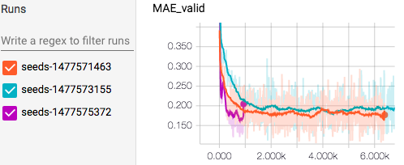

tensorboard_logger
==================

.. image:: https://img.shields.io/pypi/v/tensorboard_logger.svg
        :target: https://pypi.python.org/pypi/tensorboard_logger

.. image:: https://img.shields.io/travis/TeamHG-Memex/tensorboard_logger.svg
        :target: https://travis-ci.org/TeamHG-Memex/tensorboard_logger

Log TensorBoard events without touching TensorFlow
--------------------------------------------------

`TensorBoard <https://www.tensorflow.org/how_tos/summaries_and_tensorboard/>`_
is a visualization tool (not this project, it's a part of
`TensorFlow <https://www.tensorflow.org>`_ framework)
that makes it easy to check training progress, compare between
different runs, and has lots of other cool features.

``tensorboard_logger`` library allows to write TensorBoard events without touching TensorFlow::

    from tensorboard_logger import configure, log_value

    configure("runs/run-1234")

    for step in range(1000):
        v1, v2 = do_stuff()
        log_value('v1', v1, step)
        log_value('v2', v2, step)

Note: if you are already using TensorFlow in your project,
you probably don't need this library.

**Warning:** this is pre-alpha software, some stuff might work but it's not tested much yet.

Installation
------------

You need to `install <https://www.tensorflow.org/get_started/os_setup.html#download-and-setup>`_
TensorFlow first: it is required both for writing events and for viewing them
with TensorBoard. You probably want a CPU-only version.
After that, install ``tensorboard_logger`` with pip::

    pip install tensorboard_logger

There is a plan to get rid of TensorFlow runtime dependency:
https://github.com/TeamHG-Memex/tensorboard_logger/issues/1

Usage
-----

You can either use default logger with ``tensorboard_logger.configure``
and ``tensorboard_logger.log_value`` functions, or use ``tensorboard_logger.Logger`` class.

This library can be used to log numerical values of some variables in TensorBoard format, so you can
use TensorBoard to visualize how they changed, and compare same variables between different runs.
Log file is written into a directory, so you need a separate directory for each run
(you can place other logs or output files you use in the same directory).
Directories from different runs you wish to compare should have the same parent
(there can be other files or directories with the same parent, TensorBoard will figure out
which directories contain logs).

Apart from variable names and their values, another important thing is the **step**: this must
be an integer that represents some increasing step - it can be a step in training or some
other number. The values are ordered by step in TensorBoard, although you can view them
ordered by time or relative step too.

A simple usage example::

    from tensorboard_logger import configure, log_value

    configure("runs/run-1234", flush_secs=5)

    for step in range(1000):
        v1, v2 = do_stuff()
        log_value('v1', v1, step)
        log_value('v2', v2, step)

You can start TensorBoard right away::

    tensorboard --logdir runs

And go check the metrics to TensorBoard UI at http://localhost:6006
(note that it binds to 0.0.0.0 by default).
Metrics are refreshed on switch to browser tab, and there is also a refresh button
at the top right.

Runtime overhead is large compared to what you would expect from normal logging,
so you might need to throttle it: a single ``log_value`` call takes about 0.5 ms
(or 0.0005 s, or 2000 operations/second).
This might get solved in https://github.com/TeamHG-Memex/tensorboard_logger/issues/1.

API
---

``tensorboard_logger.configure(logdir, flush_secs=2)``

Configure logging: a file will be written to ``logdir``, and flushed every ``flush_secs``.

``tensorboard_logger.log_value(name, value, step)``

Log new ``value`` for given ``name`` on given ``step``.
``value`` should be a real number (it will be converted to float),
and ``name`` should be a string (it will be converted to a valid
TensorFlow summary name). ``step`` should be an non-negative integer,
and is used for visualization: you can log several different
variables on one step, but should not log different values
of the same variable on the same step (this is not checked).

``tensorboard_logger.Logger``

A class for writing logs in a directory.
Use it if default logger used in two above functions is not enough for you
(e.g. you want to log into several different directories, or don't like
global variables).
Constructor has the same signature as ``tensorboard_logger.configure``,
and it has a single ``log_value`` method with the same signature as
``tensorboard_logger.log_value``.

License
-------

MIT license

